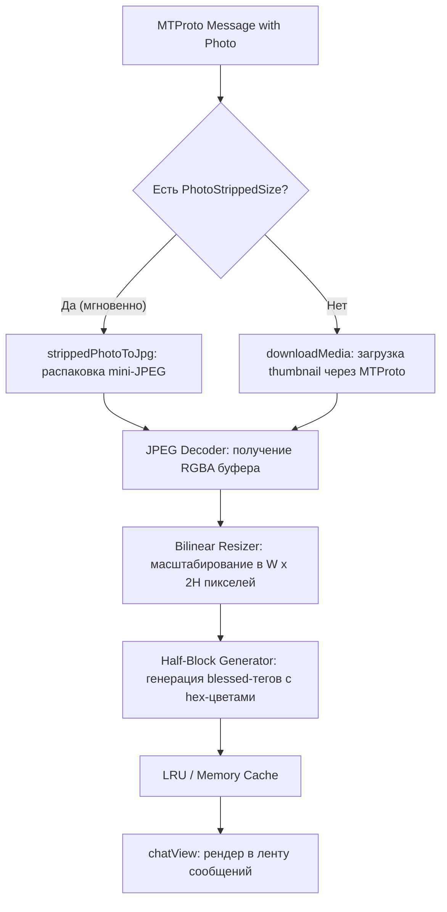

# План доработки: Отображение изображений в сообщениях TuiGram (ANSI Half-Block Pixel Art)

## 1. Описание задачи и цели

В настоящее время TuiGram отображает медиа-вложения только в виде текстовых бейджей:
`[📷 Фотография]`.

**Цель доработки**: реализовать вывод цветных превью изображений прямо в ленте сообщений чата (`chatView`), используя псевдографику высокого разрешения (Unicode Half-Block `▀`/`▄`), так чтобы изображение визуально соответствовало оригиналу по пропорциям, деталям и цветам, гармонично встраивалось в существующую верстку `neo-blessed`, поддерживало плавную прокрутку, перекрытие модальными окнами и не замедляло интерфейс.

---

## 2. Архитектурный анализ и техническое решение

### 2.1. Метод отображения: Half-Block Character Rendering (`▀` U+2580 / `▄` U+2584)
- **Принцип работы**: стандартный моноширинный символ терминала имеет соотношение сторон ~1:2 (ширина к высоте, например 8×16 px). Символ верхнего полублока `▀` делит ячейку по вертикали на два субпикселя:
  - Верхний субпиксель красится цветом текста (`fg` / `{ #hex-fg }`).
  - Нижний субпиксель красится цветом фона (`bg` / `{ #hex-bg }`).
- **Преимущества**:
  1. **Идеальное соотношение сторон 1:1** для каждого субпикселя (квадратные пиксели).
  2. **Удвоенное вертикальное разрешение** по сравнению с классическим ASCII/space-артом.
  3. **100% совместимость** со всеми терминалами (macOS Terminal.app, iTerm2, Kitty, Alacritty, WezTerm, Linux console, Windows Terminal, SSH, tmux) — символ `▀` входит в базовый блок Unicode U+2580.
  4. **Нативная интеграция в `neo-blessed`**: картинка представляет собой обычный текст с тегами цвета blessed, поэтому она:
     - прокручивается вместе с сообщениями клавишами `PageUp`/`PageDown` / мышью;
     - корректно обрезается границами `chatView`;
     - корректно перекрывается модальными окнами (`helpModal`, `fileModal`, `actionModal`, `confirmModal`) без графических артефактов и остаточных следов, свойственных Sixel/Kitty-протоколам.

### 2.2. Конвейер получения и обработки изображений



1. **Мгновенные превью (Zero Network Latency)**:
   - В Telegram почти каждое сообщение с фотографией содержит `PhotoStrippedSize` прямо в структуре сообщения (`sizes`).
   - `PhotoStrippedSize` распаковывается в валидный JPEG буфер за доли миллисекунды (без обращения к сети MTProto).
2. **Фоновая догрузка (Background Fetching)**:
   - Для сообщений без stripped-превью (или документов-изображений) запускается фоновая загрузка уменьшенного превью (`thumb`) через `downloadMedia(client, rawMessage)`.
   - По завершении декодирования обновляется кэш превью и вызывается перерисовка `chatView`.
3. **Кэширование**:
   - Кэш готовых строк псевдографики `Map<string, string>` (по ключу `photoId_width`), чтобы не декодировать и не пересчитывать изображение при каждом скролле.

---

## 3. Требуется согласование с пользователем (User Review Required)

> [!IMPORTANT]
> **Выбор библиотеки декодирования изображений**:
> В соответствии с правилами проекта (`AGENTS.md`, `architecture.md`) количество внешних зависимостей минимизируется, и они должны быть чистым JS без нативных C++ бинарников (чтобы пакет устанавливался и работал везде без `node-gyp`).
> 
> Предлагается использовать **`jpeg-js`** (чистый JS, 0 зависимостей, вес ~30 КБ) для декодирования JPEG-буферов (все stripped thumbnails и 99% фото Telegram) + легковесный модуль масштабирования на чистом JS.
> При необходимости поддержки PNG можно также подключить **`pngjs`** (чистый JS).
> 
> *Альтернатива*: подключить `@jimp/custom` (тяжелее по весу, но покрывает больше форматов).
> 
> **Рекомендация**: использовать связку `jpeg-js` (и при необходимости `pngjs`) — это даёт минимальный размер пакета и максимальную скорость работы.

> [!TIP]
> **Настройки по умолчанию**:
> - `SHOW_IMAGES=true` (показывать превью картинок в чате, можно отключить через `.env` или конфиг).
> - `IMAGE_MAX_WIDTH=36` (максимальная ширина картинки в колонках символов, отлично смотрится при стандартной ширине окна чата).
> - `IMAGE_MAX_HEIGHT=14` (максимальная высота в строках терминала = 28 пикселей по вертикали).

---

## 4. План изменений по компонентам

### 4.1. Зависимости (`package.json`)
#### [MODIFY] `package.json`
- Добавление `jpeg-js` (и `pngjs` при необходимости) в секцию `dependencies`.

---

### 4.2. Утилиты обработки и генерации изображений (`src/utils/image.js`)
#### [NEW] `src/utils/image.js`
- **Функции модуля**:
  - `decodeImageBuffer(buffer, mimeType)`: декодирует буфер (JPEG/PNG) в `{ width, height, data: Uint8Array RGBA }`.
  - `resizeRgba(src, srcW, srcH, dstW, dstH)`: билинейное/nearest-neighbor масштабирование RGBA буфера к целевым размерам с сохранением пропорций (`aspect ratio`).
  - `rgbaToHalfBlockBlessed(data, width, height, options)`: преобразует матрицу пикселей в многострочную строку blessed с тегами `{ #rrggbb-fg }{ #rrggbb-bg }▀{ /#rrggbb-bg }{ /#rrggbb-fg }`.
  - `renderStrippedThumbnail(strippedBytes, maxWidth, maxHeight)`: мгновенная распаковка и рендеринг `PhotoStrippedSize` в строку half-block.
  - `rgbaToHex(r, g, b)`: хелпер быстрого форматирования в `#rrggbb`.

---

### 4.3. Конфигурация (`src/config.js` и `.env.example`)
#### [MODIFY] `src/config.js`
- Добавление параметров конфигурации:
  - `config.showImages`: boolean (из `process.env.SHOW_IMAGES !== "false"`, по умолчанию `true`).
  - `config.imageMaxWidth`: number (из `process.env.IMAGE_MAX_WIDTH || 36`).
  - `config.imageMaxHeight`: number (из `process.env.IMAGE_MAX_HEIGHT || 14`).

#### [MODIFY] `.env.example`
- Добавление секции параметров рендеринга изображений:
  ```env
  # Отображение превью изображений в чате (true/false)
  SHOW_IMAGES=true
  # Максимальный размер превью (в символах терминала)
  IMAGE_MAX_WIDTH=36
  IMAGE_MAX_HEIGHT=14
  ```

---

### 4.4. Telegram-слой (`src/telegram/messages.js` и `src/telegram/formatter.js`)
#### [MODIFY] `src/telegram/formatter.js`
- Добавление хелпера форматирования блока медиа с превью изображения:
  - Если у сообщения есть готовое превью (или `strippedThumb`), формируется блок:
    ```
    [📷 Фотография]
      <half-block image preview lines>
    ```
  - Если превью отключено в настройках, отображается классический текстовый бейдж.

#### [MODIFY] `src/telegram/messages.js`
- В `normalizeMessage`:
  - Извлечение данных `photo` и `strippedThumb` (из `photo.sizes.find(s => s.className === "PhotoStrippedSize")`).
  - Генерация синхронного превью из `strippedThumb` при нормализации (занимает <1 мс) с сохранением в `message.imagePreview`.
- Добавление функции `loadMessageImagePreview(client, rawMessage, options)` для асинхронной подгрузки превью, если stripped-размер отсутствует.

---

### 4.5. UI-слой (`src/ui/components/chatView.js` и `src/ui/app.js`)
#### [MODIFY] `src/ui/components/chatView.js`
- В `renderMessages(messages)`:
  - Включение блока `msg.imagePreview` в тело сообщения с аккуратным 2-пробельным отступом.
  - Сохранение правильного переноса строк и выравнивания даты/реакций/подписи.

#### [MODIFY] `src/ui/app.js`
- Интеграция фоновой догрузки превью для сообщений, у которых нет stripped thumbnail (по событию появления в активном чате), с обновлением `state` и перерисовкой.

---

### 4.6. Тестирование (`test/unit.test.js`)
#### [MODIFY] `test/unit.test.js`
- Добавление новой секции тестов: **«Тесты генерации превью изображений (image.js)»**:
  - Проверка распаковки stripped JPEG заголовков.
  - Проверка декодирования и масштабирования синтетического RGBA буфера (сохранение пропорций).
  - Проверка генерации half-block строки: валидность тегов blessed, отсутствие незакрытых тегов, правильность соотношения строк и столбцов.
  - Проверка экранирования и работы кэша.

---

### 4.7. Документация (`README.md`, `README.ru.md`, `CHANGELOG.md`, `CHANGELOG.ru.md`)
#### [MODIFY] `CHANGELOG.md` & `CHANGELOG.ru.md`
- Добавление записи в секцию `[Unreleased]` / `Added`:
  - RU: «Отображение цветных превью изображений в сообщениях чата с помощью псевдографики высокого разрешения (Unicode Half-Block) и мгновенным рендерингом stripped thumbnails.»
  - EN: «Display color image previews in chat messages using high-resolution Unicode half-block characters with instant stripped thumbnail rendering.»

#### [MODIFY] `README.md` & `README.ru.md`
- Обновление описания возможностей и мокапов интерфейса.

---

## 5. План верификации

### 5.1. Автоматические тесты
```bash
npm test
node scripts/check-package.js
```
- Все существующие и новые юнит-тесты должны выполняться со статусом `pass`.
- `check-package.js` должен подтвердить чистоту состава будущего npm-пакета.

### 5.2. Ручная проверка (TUI)
1. Запуск `npm start`.
2. Открытие чата с фотографиями:
   - Проверка мгновенного появления превью картинок из `PhotoStrippedSize`.
   - Проверка корректности цветов и узнаваемости изображения.
   - Проверка вертикального и горизонтального масштаба (пропорции соответствуют оригиналу).
3. Прокрутка ленты сообщений (`PageUp`, `PageDown`, колесо мыши) — отсутствие дерганий и зависаний.
4. Открытие модальных окон поверх сообщений с картинками (`F1`, `Ctrl+O`, `Ctrl+A`) — чистое перекрытие без графического мусора.
5. Проверка переключения тем (`default`, `nord`, `light`) — фон и границы картинок гармонируют с темой.
